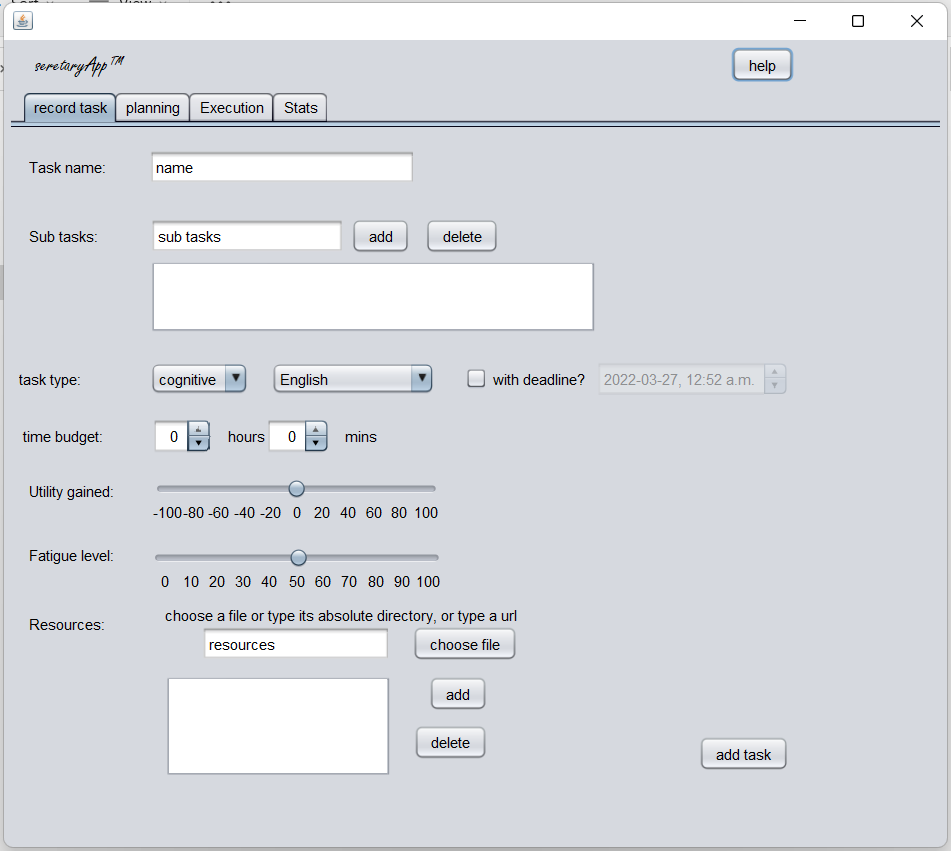
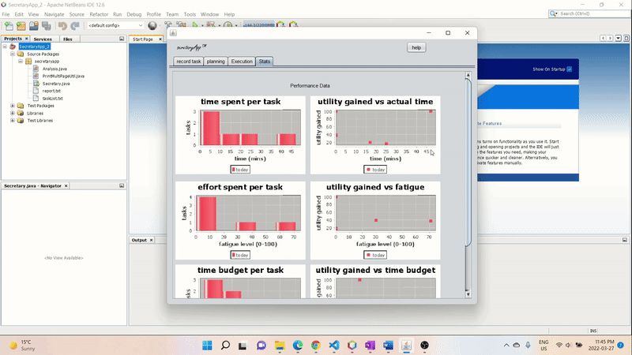

# secretaryApp

## Project Overview
secretaryApp is a tool that is designed to filter out grunt work and makes daily life a lot simpler and eliminate repetitions of useless work

## Inspiration
I have an idea which is best illustrated by the following analogy: it's better to develop a better axe then chop the tree down with ease rather than to spend all day chopping the tree with a dull axe. And secretaryApp is the better axe that will help me and others to complete work with far more efficiency

## What it does
It makes your life easier by performing the following functions:
* Task recording: take in the details of the task

* Sets up and organizes tasks: you find resources and put them into here. Next time, with just one click, you can open up all the things you need to keep working

* Based on your preferences, provides recommendations for how you can schedule your work

* Reflections: Automatically records your task data (the time the task is completed, stress level of task, efficiency of task, types of task etc.) and gives analysis for your reflections

## How I built it
* planning for this project started a long time ago. I used 3 weeks in total to brainstorm the ideas (what is most useful to me, what is realistic to do etc.).
* I then spent around 2 days building a prototype, which involves:
    * building the first tab and coding how the components on the panel result in a task with all sorts of info
    * building the second tab and the feature of clicking on items to move them to the other box
    * building the rough prototype for the static methods in hte analysis class, which sorts the tasks in all sorts of order according to their characteristics
    * trying to get a class called checkbox tree (JTree with checkboxes) to work in the third tab but failed
* Then, I spent 1.5 day building the third tab and fourth tab
    * using normal JTree to construct executingTasks and coding the start and finish task buttons in third tab
    * learning about chart libraries created by others, building charts in the fourth tab and connecting them with finishedTasks
    * getting read and write to work and intertwine with the taskList, currentTasks, finishedTasks
* I then spent much more time (around 4 days) debugging and simplifying much of the convoluted code and added more functions (resources, printing the analysis page, the help button) along the way
    * massive overhaul: I initially created a class for taskList and have taskList, currentTasks, finishedTasks as its variables and all methods in analysis class as methods. I changed it to a normal ArrayList
    * I initially have separate methods for different types of analysis, I simplified them into one method. took a while to change QuickSort method
    * I added getRecommended method to analysis class which performs the function of machine learning. this also took a while to work properly
    * I spent a few hours adding resources, restart planning button, printing for the third tab and help button and textual instructions
    * I further organized the code to get rid of repetition: made some methods, some variables, changed some code for the better
    * I spent around 2 days fixing bugs everywhere, especially when I reworked some code, added new functions.

## Notes for users
* instructions on how to use the app is accessed by clicking the help button inside the app. "help" shows information specific to the tab you are currently in. In other words, it shows different information in different tabs.
* feel free to use the sample tasks and finished tasks I pre-recorded in the text files. If you don't want them, you can empty the text files, just make sure that there is no blank lines left in there so the reading works properly
* don't write too many subtasks or resources for one task. the txt file eventually jumps to the next line, thus breaking the file reading format of the app
* please turn off word wrap in notepad and any other features that can possibly influence the format of txt files to ensure that the read and write work properly in the app
* When compiling the app, NetBeans IDE will tell you that "Secretary.java uses unchecked or unsafe operations. Note: Recompile with -Xlint:unchecked for details.". This is normal because I have used an ArrayList of objects to store task information. I chose to do it because it makes printing task information a lot easier
* I am aware that some code can be classified into separate classes (fileReadAndWrite, task). However, I still chose to keep such code in the same class because I don't think the code gets much simpler when I do so
* I did not use a class to create all the charts. the charts belong to a library called JFreeCharts
* I did not bother naming some jScrollPanes, jLabels and jPanels etc because they are either very obvious or have no significance in the core functions of the program
* The print button in the last tab prints incomplete documents and I have not been successful in fixing it. However, because printing documents is a minor function of the program, I have left the bug be.
