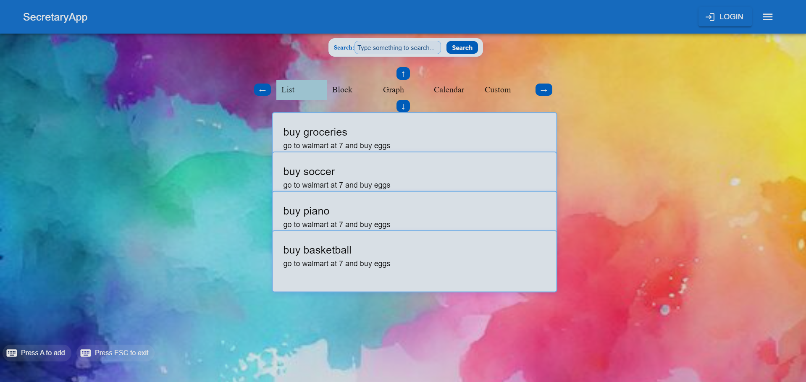

# Secretary App

## Overview

**Secretary App** is a highly customizable, minimalistic scheduling and task management app designed to give users freedom in how they plan, organize, and visualize their tasks. Unlike traditional project management software or calendar tools that impose rigid structures, Secretary App is built from first principles, focusing on flexibility, personalization, and ease of use.

The app aims to provide powerful visualization tools for tasks and schedules, making planning intuitive, while automating repetitive processes to help users achieve their scheduling goals faster.

## Features

### 1. **Freedom & Customization**
- **Task Flexibility**: At its core, a task is represented as a **block** that can be customized with various properties such as due dates, durations, precedents, groupings, and more. Users can also define custom properties (e.g., task type, utility gained, fatigue level, recurring status, etc.).

### 2. **Multiple Task Views**
- **Block View**: Simple, visual block representation of tasks.
- **List View**: Organized list with support for viewing task groups and sorting.
- **Calendar View**: Traditional calendar display of tasks.
- **Dependency Graph**: Visualize task dependencies and connections.
- **Custom View (Analytics)**: A customizable analytics tool to monitor important metrics and priorities in your life.
- **Map View (Coming Soon)**: Visualize tasks based on location.

Each view is fully customizable, with support for searching, filtering, and grouping tasks. These views are treated as transformations of the same underlying task data, allowing users to switch seamlessly between views without losing context.

## Planned Features

### 1. **Automation & Suggestions**
- **Task Suggestions**: The app can suggest optimal task orders and workflows, leveraging brute-force algorithms to provide helpful recommendations for task execution.
- **Automation**: Streamline repetitive tasks and automate scheduling decisions based on user-defined parameters.

### 2. **Voice Control & AI Input**
- Move away from forms for task input. Instead, the app encourages the use of **voice commands** and **ChatGPT-like interactions** for input and output, making task creation and management faster and more intuitive.
- **Secretary Avatar**: A customizable avatar (default is an animal) will assist the user, acting as the main interface for task management.

## Data Management

Tasks are stored in a decentralized file-based system. This gives users full control over their data and ensures that task information is persistent and portable across platforms. Users can manage multiple calendars, merge external schedules, and store task data locally or in the cloud without relying on proprietary databases.

## Aesthetics

Inspired by the tactical look of the **Metal Gear Solid V** menu system, the UI is sleek and minimalist, with an emphasis on clarity and user engagement:
- **Customizable Style**: Users can adjust the display style to match their personality, and special effects will celebrate task completion to encourage progress.
- **Animations**: Task views transition smoothly with fluid animations, helping users maintain focus and flow.

## Implementation

The app is built using the **MVC (Model-View-Controller) framework**:
- **Model**: Manages task data and properties.
- **View**: Supports multiple, customizable views like block view, list view, calendar view, and more.
- **Controller**: Handles task input through various means, including voice commands and ChatGPT-like prompts.

The app is optimized for performance, with efficient sorting and searching algorithms to handle large task lists. 

## Platforms

Secretary App will be available on:
- **Mobile** (iOS and Android)
- **Web**
- **Desktop** (Linux, Windows, macOS)

## UI/UX Design

- **Keyboard Shortcuts**: Toggle between views and tasks, add or delete tasks, and perform quick CRUD operations using intuitive keyboard shortcuts.
- **Animated Transitions**: Views and tasks animate dynamically when changing positions, highlighting the different transformations of the same data.
- **Customization Settings**: Abstract away annoying customization details by accessing advanced settings in the background.

4. **Submit Pull Requests**: Feel free to submit pull requests for improvements or new features!

## Future Enhancements

- **VR Support**: A VR mode that allows users to manage their tasks in a fully immersive 3D environment.
- **Advanced Analytics**: Custom dashboards for tracking productivity, task completion rates, and energy/fatigue levels.
- **Collaboration Features**: Share schedules and collaborate with teammates directly in the app.
  
---

Get ready to revolutionize how you manage your schedule with **Secretary App**—a flexible, intuitive, and open-source approach to task management.

